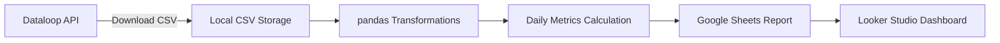

# 📊 Dataloop Datapoints Usage Tracker  

## 📖 Description  
The **Dataloop Datapoints Usage Tracker** is a pipeline that monitors **daily datapoint consumption** across projects in Dataloop.  

It combines **API integration, pandas transformations, Google Sheets, and Looker Studio** (with mock/fake data) to:  
- Download daily usage reports from the Dataloop API (CSV format)  
- Calculate **daily validated items, annotations, and total datapoints**  
- Track usage **per project** to identify heavy consumers  
- Push results automatically to Google Sheets  
- Create **visual dashboards in Looker Studio** for easy monitoring  

This project uses **mock/fake data** to remain portfolio-safe.  

---

## 🚀 Why This Matters  
Datapoints in Dataloop are tied to a **yearly budget**, making it critical to track consumption.  

- **Prevent overspending** – Daily tracking ensures the team stays within the budget.  
- **Hold teams accountable** – Usage is broken down **per project**.  
- **Enable forecasting** – Daily increments support long-term budget planning.  
- **Automate reporting & visualization** – Reports update daily and dashboards in Looker Studio keep stakeholders aligned.  

---

## 🛠️ Key Skills Demonstrated  
- **API integration** with authentication tokens  
- Python data processing with **pandas**  
- Time-series analysis (**daily increments from cumulative totals**)  
- ETL pipeline automation (Extract → Transform → Load)  
- Automated reporting with **Google Sheets**  
- Interactive dashboards in **Looker Studio**  
- Cost monitoring & resource optimization  

---

## 🔄 Project Workflow  

---

## 📂 Example Table (with fake data)

| Project Name    | Owning Org | Max Managed Items | Max Annotations | date       | Max Managed Items Diff | Max Annotations Diff | Daily Validated Items | Daily Validated Annot | Total DP |
| --------------- | ---------- | ----------------- | --------------- | ---------- | ---------------------- | -------------------- | --------------------- | --------------------- | -------- |
| Apex Playground | Org\_A     | 1092              | 34119           | 2025-01-01 | NaN                    | NaN                  | 0                     | 0                     | 0        |
| Apex Playground | Org\_A     | 1092              | 34119           | 2025-01-02 | 0                      | 0                    | 0                     | 0                     | 0        |
| Apex Playground | Org\_A     | 1093              | 34120           | 2025-01-03 | 1                      | 1                    | 1                     | 1                     | 2        |
| Project\_B      | Org\_B     | 500               | 1200            | 2025-01-03 | 3                      | 0                    | 3                     | 0                     | 3        |

## ▶️ How to Run (with mock data)

1. Install dependencies:
``pip install pandas requests pygsheets``

2. Configure credentials (replace with your own service account file & fake API token).

3. Run the pipeline:

``python datapoints_report.py``

4. Output:

- CSV reports saved locally
- Combined report pushed to Google Sheets
- Daily usage per project visible in Looker Studio dashboards

## 📈 Example Dashboard (Looker Studio)  

The final visualization is built in **Looker Studio**, where stakeholders can track datapoint usage interactively.  

### Included Charts:
- 📊 **Data Point Usage by Team** (pivot table) – compares datapoints consumed per team  
- 🥧 **Team Data Points Usage Proportion** (pie chart) – shows share of total consumption  
- 📉 **Daily Average Data Points Usage** (bar chart) – highlights usage trends  
- 📈 **Daily Data Points Usage (Cumulative)** (time series) – monitors growth over time  
- 📏 **Budget Progress Bars** –  
  - General datapoints usage vs yearly budget  
  - Per-team datapoints usage vs their allocated budget

This combination allows:  
- Easy identification of **which teams are over/under budget**  
- Quick **forecasting of depletion date**  
- Transparent **accountability per team**  
- Clear view of **daily and cumulative usage patterns**  

